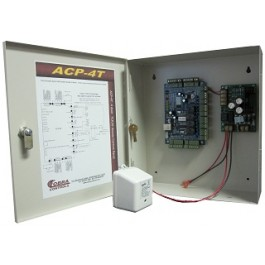

# Cobra Controls


[](https://pkg.go.dev/github.com/tekkamanendless/cobra-controls)

This suite of tools deals with the Cobra Controls ACP-T series (typically sold before 2016).

Using this, you should be able to completely ignore the Windows software that the company provides (but no longer updates).

## Supported equipment
If you have any of the ACP-T series control boards, this should work for you.

This includes:

* ACP-1T
* ACP-2T
* ACP-4T
* ACP-4TF



## Development
The `view-packets` tool requires `libpcap-dev` on Ubuntu systems.

```
sudo apt install libpcap-dev
```
